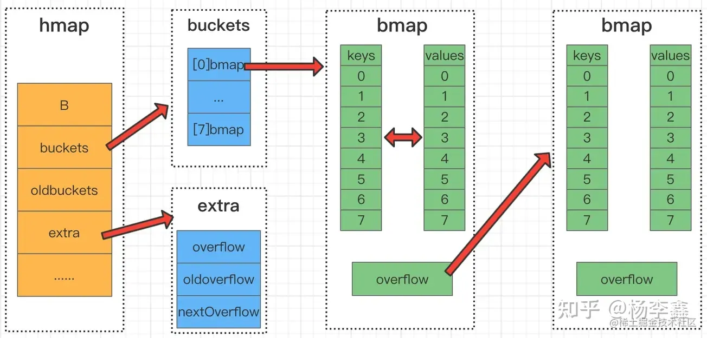

### 数组
一种具有固定长度的基本数据结构,一旦创建了它的长度就不允许改变,数组的空余位置用缺省值填补,不允许数组越界。值拷贝传递

### Slice
基于数组的实现，是长度动态不固定的数据结构，本质上是一个对数组字序列的引用，提供了对数组的轻量级访问。
<br>len： 读写不能超过, capacity： 最大扩张容量
<br>由于slice进行追加的元素超出了原来数组的大小,因此go内部会帮我们创建一个新的底层数组,而slice的引用地址不再是arr了，变成了新创建的数组。

### Map
```go
// 创建
// map[KeyType]ValueType
var m map[int]int
m := make(map[int]int)
m := map[int]int{
1: 1,
2: 2,
}
// 读取
i := m[1]
v, ok := m[1]
​
// 遍历
for key, value := range m {
println("Key: ", key, "Value: ", value)
}
​
// 删除
delete(m, 1)
```

相同容量扩容: 元素会发生重排，但不会换桶。<br>
2倍容量扩容: 发生这种扩容时，元素会重排，可能会发生桶迁移。

线程不安全：
```go
type Resource struct {
    sync.RWMutex
    m map[string]int
}
​
func main() {
    r := Resource{m: make(map[string]int)}
​
    go func() { //开一个goroutine写map
        for j := 0; j < 100; j++ {
            r.Lock()
            r.m[fmt.Sprintf("resource_%d", j)] = j
            r.Unlock()
        }
    }()
    go func() { //开一个goroutine读map
        for j := 0; j < 100; j++ {
            r.RLock()
            fmt.Println(r.m[fmt.Sprintf("resource_%d", j)])
            r.RUnlock()
        }
    }()
}
```
map数据进行操作时不可取地址,
因为随着map元素的增长，map底层重新分配空间会导致之前的地址无效。

sync.Map (适合读多写少)
```go
type Map struct {
 mu Mutex
 read atomic.Value // readOnly
 dirty map[interface{}]*entry
 misses int
}
```