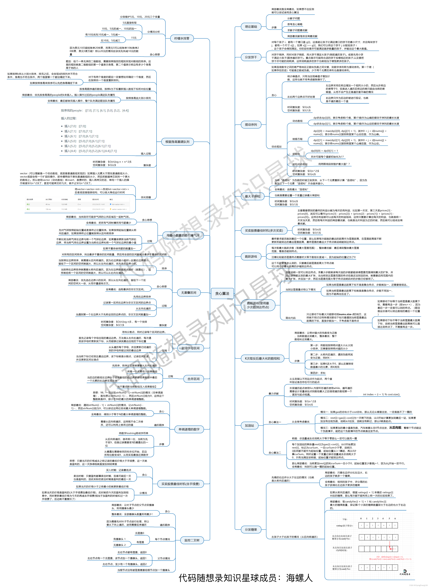

---
hide:
  - toc
title: Day 32 贪心，动态规划
---

### [738. 单调递增的数字](https://leetcode.cn/problems/monotone-increasing-digits/)

**题目**：当且仅当每个相邻位数上的数字 x 和 y 满足 x <= y 时，我们称这个整数是单调递增的。

给定一个整数 n ，返回 小于或等于 n 的最大数字，且数字呈 单调递增 。

**思路**：从后往前遍历（重复利用上次比较的结果），找到不是单调递增的下标，减一，剩余数字尽可能的大，改为9。

```cpp
class Solution {
public:
    int monotoneIncreasingDigits(int n) {
        string num = to_string(n);
        int idx = num.length();
        for (int i = idx - 1; i > 0; i--) {
            if (num[i - 1] > num[i]) {
                num[i - 1]--;
                idx = i;
            }
        }
        for (int i = idx; i < num.length(); i++) {
            num[i] = '9';
        }
        return stoi(num);
    }
};
```

### [968. 监控二叉树](https://leetcode.cn/problems/binary-tree-cameras/)

**题目**：给定一个二叉树，我们在树的节点上安装摄像头。

节点上的每个摄影头都可以监视其父对象、自身及其直接子对象。

计算监控树的所有节点所需的最小摄像头数量。

**思路**：局部最优：让叶子节点的父节点安摄像头，所用摄像头最少，整体最优：全部摄像头数量所用最少<br>
从下往上：后序遍历

节点状态：该节点无覆盖/本节点有摄像头/本节点有覆盖<br>
空节点的状态只能是有覆盖，这样就可以在叶子节点的父节点放摄像头

```cpp
class Solution {
public:
    int res;
    int traverse(TreeNode* root) {
        // 0：该节点无覆盖
        // 1：本节点有摄像头
        // 2：本节点有覆盖
        if (!root) {
            // 空节点为已覆盖
            return 2;
        }
        int l = traverse(root->left);
        int r = traverse(root->right);
        if (l == 2 && r == 2) {
            return 0;
        } else if (l == 0 || r == 0) {
            res++;
            return 1;
        } else {
            return 2;
        }
    }
    int minCameraCover(TreeNode* root) {
        res = 0;
        if (traverse(root) == 0) {
            res++;
        }
        return res;
    }
};
```


动态规划中每一个状态一定是由上一个状态推导出来的，这一点区分于贪心，贪心没有状态推导，而是从局部直接选最优的

- 确定dp数组（dp table）以及下标的含义
- 确定递推公式
- dp数组如何初始化
- 确定遍历顺序
- 举例推导dp数组

###[746. 使用最小花费爬楼梯](https://leetcode.cn/problems/min-cost-climbing-stairs/)

**题目**：给你一个整数数组 cost ，其中 cost[i] 是从楼梯第 i 个台阶向上爬需要支付的费用。一旦你支付此费用，即可选择向上爬一个或者两个台阶。

你可以选择从下标为 0 或下标为 1 的台阶开始爬楼梯。

请你计算并返回达到楼梯顶部的最低花费。

```cpp
class Solution {
public:
    int minCostClimbingStairs(vector<int>& cost) {
        vector<int> dp(cost.size() + 1);
        dp[0] = 0; // 默认第一步都是不花费体力的
        dp[1] = 0;
        for (int i = 2; i <= cost.size(); i++) {
            dp[i] = min(dp[i - 1] + cost[i - 1], dp[i - 2] + cost[i - 2]);
        }
        return dp[cost.size()];
    }
};
```